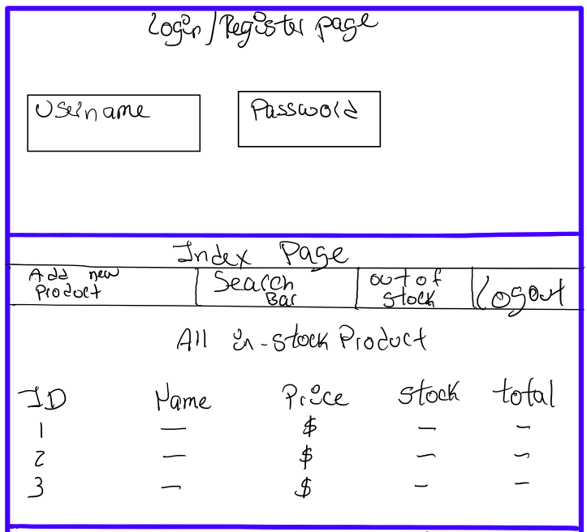
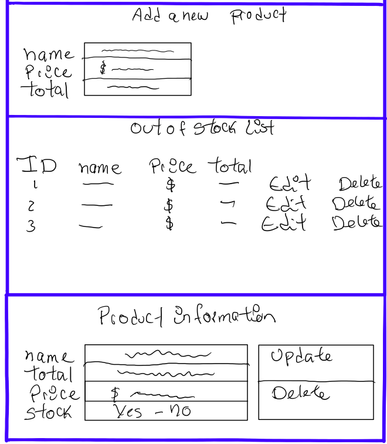

# Inventory App

## User Story

- User should be able to register and login
- Be able to add products to the inventory
- Be able to delete products from the inventory
- Be able to click on each product in the inventory
- Be able to add the price to those products
- Be able to edit the price, product info, quantity
- Be able to see all products currently in stock
- Be able to search products by name
- Be able to see the quantity of all products in stock
- Be able to see all products out of stock
- Be able to search for an specific product

## Data Tables

- User Table
  - ID
  - Username
  - Password

- Product Table
  - ID
  - Name
  - Price
  - Stock
  - Total

## Wireframe

